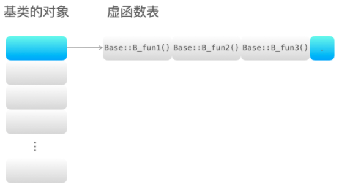
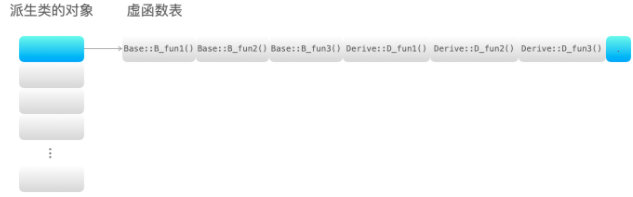
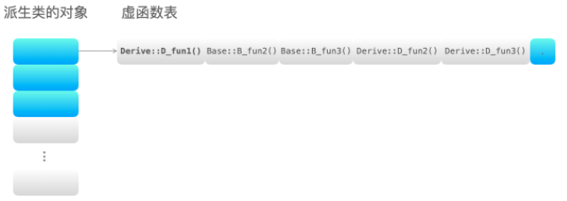
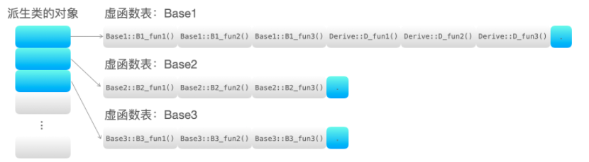
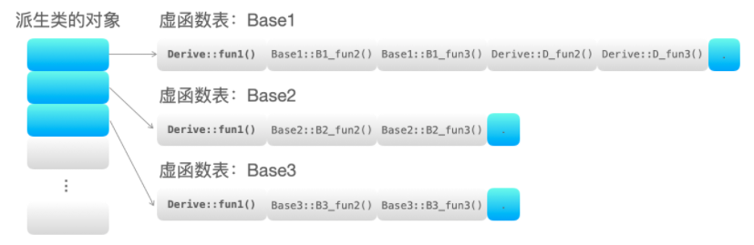
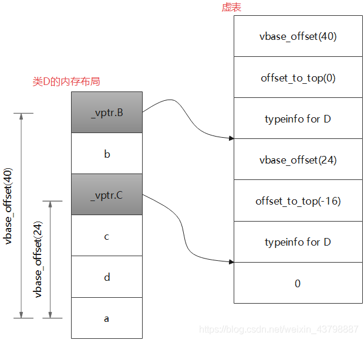

- [构造函数](#构造函数)
    - [拷贝构造函数](#拷贝构造函数)
    - [赋值运算符](#赋值运算符)
    - [拷贝构造函数和赋值运算符的区别](#拷贝构造函数和赋值运算符的区别)
- [面向对象](#面向对象)
  - [面向对象的三大特性:](#面向对象的三大特性)
  - [重载, 重写(覆盖)和隐藏](#重载-重写覆盖和隐藏)
    - [重载(overload)：](#重载overload)
    - [隐藏：](#隐藏)
    - [重写(覆盖)(override)：](#重写覆盖override)
    - [重写和重载的区别：](#重写和重载的区别)
    - [隐藏和重写，重载的区别：](#隐藏和重写重载的区别)
  - [多态](#多态)
  - [虚函数和纯虚函数](#虚函数和纯虚函数)
    - [虚函数的实现机制](#虚函数的实现机制)
    - [编译器处理虚函数表](#编译器处理虚函数表)
  - [虚继承](#虚继承)
  - [抽象类](#抽象类)
# 构造函数

### 拷贝构造函数
调用场景:  
    对象作为函数的参数，以值传递的方式传给函数。　
    对象作为函数的返回值，以值的方式从函数返回
    使用一个对象给另一个对象初始化

### 赋值运算符
赋值运算符为什么返回引用: 
为了支持赋值连接: (因为传进去参数是个引用)
```c++
Foo a, b, c;
// ...
a = b = c;
```

### 拷贝构造函数和赋值运算符的区别
拷贝构造函数和赋值运算符的行为比较相似，都是将一个对象的值复制给另一个对象；但是其结果却有些不同，**拷贝构造函数使用传入对象的值生成一个新的对象的实例，而赋值运算符是将对象的值复制给一个已经存在的实例**。  
调用时机: 调用的是拷贝构造函数还是赋值运算符，**主要是看是否有新的对象实例产生**。如果产生了新的对象实例，那调用的就是拷贝构造函数；如果没有，那就是对已有的对象赋值，调用的是赋值运算符。  
在默认情况下（用户没有定义，但是也没有显式的删除），编译器会自动的隐式生成一个拷贝构造函数和赋值运算符。但用户可以使用=delete来指定不生成拷贝构造函数和赋值运算符，这样的对象就不能通过值传递，也不能进行赋值运算。


# 面向对象
## 面向对象的三大特性:
- 封装：将具体的实现过程和数据封装成一个函数，只能通过接口进行访问，降低耦合性。

- 继承：子类继承父类的特征和行为，子类有父类的非 private 方法或成员变量，子类可以对父类的方法进行重写，增强了类之间的耦合性，但是当父类中的成员变量、成员函数或者类本身被 final 关键字修饰时，修饰的类不能继承，修饰的成员不能重写或修改

- 多态：多态就是不同继承类的对象，对同一消息做出不同的响应，基类的指针指向或绑定到派生类的对象，使得基类指针呈现不同的表现方式

## 重载, 重写(覆盖)和隐藏
### 重载(overload)：
是指同一可访问区内被声明几个具有不同参数列（参数的类型、个数、顺序）的同名函数，根据参数列表确定调用哪个函数，重载不关心函数返回类型。
```c++
class A
{
public:
    void fun(int tmp);
    void fun(float tmp);        // 重载 参数类型不同（相对于上一个函数）
    void fun(int tmp, float tmp1); // 重载 参数个数不同（相对于上一个函数）
    void fun(float tmp, int tmp1); // 重载 参数顺序不同（相对于上一个函数）
    int fun(int tmp);            // error: 'int A::fun(int)' cannot be overloaded 错误：注意重载不关心函数返回类型
};
```
### 隐藏：
是指派生类的函数屏蔽了与其同名的基类函数，主要只要同名函数，不管参数列表是否相同，基类函数都会被隐藏。
```c++
#include <iostream>
using namespace std;

class Base
{
public:
    void fun(int tmp, float tmp1) { cout << "Base::fun(int tmp, float tmp1)" << endl; }
};

class Derive : public Base
{
public:
    void fun(int tmp) { cout << "Derive::fun(int tmp)" << endl; } // 隐藏基类中的同名函数
};

int main()
{
    Derive ex;
    ex.fun(1);       // Derive::fun(int tmp)
    ex.fun(1, 0.01); // error: candidate expects 1 argument, 2 provided
    ex.Base::fun(1, 0.01); //调用基类中的同名函数。
    return 0;
}
```
### 重写(覆盖)(override)：
是指派生类中存在重新定义的函数。函数名、参数列表、返回值类型都必须同基类中被重写的函数一致，只有函数体不同。派生类调用时会调用派生类的重写函数，不会调用被重写函数。重写的基类中被重写的函数必须有 virtual 修饰
```c++
#include <iostream>
using namespace std;

class Base
{
public:
    virtual void fun(int tmp) { 
        cout << "Base::fun(int tmp) : " << tmp << endl;
    }
};

class Derived : public Base
{
public:
    virtual void fun(int tmp) { // 重写基类中的 fun 函数
        cout << "Derived::fun(int tmp) : " << tmp << endl;
    } 
};
int main()
{
    Base *p = new Derived();
    p->fun(3); // Derived::fun(int) : 3
    return 0;
}
```
### 重写和重载的区别：
- 范围区别：对于类中函数的重载或者重写而言，**重载发生在同一个类的内部**，**重写发生在不同的类之间（子类和父类之间）**。
- 参数区别：重载的函数需要与原函数有相同的函数名、不同的参数列表，不关注函数的返回值类型；重写的函数的函数名、参数列表和返回值类型都需要和原函数相同，父类中被重写的函数需要有 virtual 修饰。
- virtual 关键字：**重写的函数基类中必须有 virtual关键字的修饰**，重载的函数可以有 virtual 关键字的修饰也可以没有。

### 隐藏和重写，重载的区别：
- 范围区别：隐藏与重载范围不同，隐藏发生在不同类中。
- 参数区别：隐藏函数和被隐藏函数参数列表可以相同，也可以不同，但函数名一定相同；当参数不同时，无论基类中的函数是否被 virtual修饰，基类函数都是被隐藏，而不是重写。

## 多态
多态就是不同继承类的对象，对同一消息做出不同的响应，基类的指针指向或绑定到派生类的对象，使得基类指针呈现不同的表现方式。在基类的函数前加上 virtual 关键字，在派生类中重写该函数，运行时将会根据对象的实际类型来调用相应的函数。如果对象类型是派生类，就调用派生类的函数；如果对象类型是基类，就调用基类的函数。

实现多态的两种方式:
- 重载：是指允许存在多个同名函数，而这些函数的参数表不同（参数个数不同、参数类型不同或者两者都不同）。
- 覆盖：是指子类重新定义父类虚函数的做法，简而言之就是用父类型别的指针指向其子类的实例，然后通过父类的指针调用实际子类的成员函数。这种技术可以让父类的指针拥有“多种形态”，这是一种泛型技术。所谓泛型技术，说白了就是试图使用不变的代码来实现可变的算法，比如：模板元编程是在编译期完成的泛型技术，RTTI、虚函数则是在运行时完成的泛型技术。
  - 实现过程：
      - 1.在类中用 virtual 关键字声明的函数叫做虚函数；
      -  2.存在虚函数的类都有一个虚函数表，当创建一个该类的对象时，该对象有一个指向虚函数表的虚表指针（虚函数表和类对应的，虚表指针是和对象对应）；
       - 3.当基类指针指向派生类对象，基类指针调用虚函数时，基类指针指向派生类的虚表指针，由于该虚表指针指向派生类虚函数表，通过遍历虚表，寻找相应的虚函数。

```c++
#include <iostream>
using namespace std;

class Base
{
public:
	virtual void fun() { cout << "Base::fun()" << endl; }

	virtual void fun1() { cout << "Base::fun1()" << endl; }

	virtual void fun2() { cout << "Base::fun2()" << endl; }
};
class Derive : public Base
{
public:
	void fun() { cout << "Derive::fun()" << endl; }

	virtual void D_fun1() { cout << "Derive::D_fun1()" << endl; }

	virtual void D_fun2() { cout << "Derive::D_fun2()" << endl; }
};
int main()
{
	Base *p = new Derive();
	p->fun(); // Derive::fun() 调用派生类中的虚函数
	return 0;
}
```


## 虚函数和纯虚函数
- 虚函数：被 virtual 关键字修饰的成员函数，就是虚函数, 虚函数必须实现，否则编译器会报错
- 纯虚函数：纯虚函数在类中声明时，加上 =0；
    - 含有纯虚函数的类称为抽象类（只要含有纯虚函数这个类就是抽象类），类中只有接口，没有具体的实现方法, 纯虚函数必须在派生类中实现后才能使用
    - 继承纯虚函数的派生类，如果没有完全实现基类纯虚函数，依然是抽象类，不能实例化对象。

### 虚函数的实现机制
实现机制：虚函数通过虚函数表来实现。虚函数的地址保存在虚函数表中，在类的对象所在的内存空间中，保存了指向虚函数表的指针（称为“虚表指针”），通过虚表指针可以找到类对应的虚函数表。虚函数表解决了基类和派生类的继承问题和类中成员函数的覆盖问题，当用基类的指针来操作一个派生类的时候，这张虚函数表就指明了实际应该调用的函数

- 虚函数表存放的内容：类的虚函数的地址。
- 虚函数表建立的时间：编译阶段，即程序的编译过程中会将虚函数的地址放在虚函数表中。
- 虚表指针保存的位置：虚表指针存放在对象的内存空间中最前面的位置，这是为了保证正确取到虚函数的偏移量。
- 虚函数表和类绑定，虚表指针和对象绑定。即类的不同的对象的虚函数表是一样的，但是每个对象都有自己的虚表指针，来指向类的虚函数表

### 编译器处理虚函数表
- 编译器将虚函数表的指针放在类的实例对象的内存空间中，该对象调用该类的虚函数时，通过指针找到虚函数表，根据虚函数表中存放的虚函数的地址找到对应的虚函数。
- 如果派生类没有重新定义基类的虚函数 A，则派生类的虚函数表中保存的是基类的虚函数 A 的地址，也就是说基类和派生类的虚函数 A 的地址是一样的。
- 如果派生类重写了基类的某个虚函数 B，则派生的虚函数表中保存的是重写后的虚函数 B 的地址，也就是说虚函数 B 有两个版本，分别存放在基类和派生类的虚函数表中。
- 如果派生类重新定义了新的虚函数 C，派生类的虚函数表保存新的虚函数 C 的地址。

[这篇文章讲的非常好](https://blog.csdn.net/weixin_43798887/article/details/118196343)
1. 单继承无虚函数覆盖的情况：
```c++
#include <iostream>
using namespace std;

class Base
{
public:
    virtual void B_fun1() { cout << "Base::B_fun1()" << endl; }
    virtual void B_fun2() { cout << "Base::B_fun2()" << endl; }
    virtual void B_fun3() { cout << "Base::B_fun3()" << endl; }
};

class Derive : public Base
{
public:
    virtual void D_fun1() { cout << "Derive::D_fun1()" << endl; }
    virtual void D_fun2() { cout << "Derive::D_fun2()" << endl; }
    virtual void D_fun3() { cout << "Derive::D_fun3()" << endl; }
};
int main()
{
    Base *p = new Derive();
    p->B_fun1(); // Base::B_fun1()
    return 0;
}
```
基类的虚函数表:

派生类的虚函数表:


2. 单继承有虚函数覆盖的情况
```c++
#include <iostream>
using namespace std;

class Base
{
public:
    virtual void fun1() { cout << "Base::fun1()" << endl; }
    virtual void B_fun2() { cout << "Base::B_fun2()" << endl; }
    virtual void B_fun3() { cout << "Base::B_fun3()" << endl; }
};

class Derive : public Base
{
public:
    virtual void fun1() { cout << "Derive::fun1()" << endl; }
    virtual void D_fun2() { cout << "Derive::D_fun2()" << endl; }
    virtual void D_fun3() { cout << "Derive::D_fun3()" << endl; }
};
int main()
{
    Base *p = new Derive();
    p->fun1(); // Derive::fun1()
    return 0;
}
```
派生类的虚函数表:


3. 多继承无虚函数覆盖的情况
```c++
#include <iostream>
using namespace std;

class Base1
{
public:
    virtual void B1_fun1() { cout << "Base1::B1_fun1()" << endl; }
    virtual void B1_fun2() { cout << "Base1::B1_fun2()" << endl; }
    virtual void B1_fun3() { cout << "Base1::B1_fun3()" << endl; }
};
class Base2
{
public:
    virtual void B2_fun1() { cout << "Base2::B2_fun1()" << endl; }
    virtual void B2_fun2() { cout << "Base2::B2_fun2()" << endl; }
    virtual void B2_fun3() { cout << "Base2::B2_fun3()" << endl; }
};
class Base3
{
public:
    virtual void B3_fun1() { cout << "Base3::B3_fun1()" << endl; }
    virtual void B3_fun2() { cout << "Base3::B3_fun2()" << endl; }
    virtual void B3_fun3() { cout << "Base3::B3_fun3()" << endl; }
};

class Derive : public Base1, public Base2, public Base3
{
public:
    virtual void D_fun1() { cout << "Derive::D_fun1()" << endl; }
    virtual void D_fun2() { cout << "Derive::D_fun2()" << endl; }
    virtual void D_fun3() { cout << "Derive::D_fun3()" << endl; }
};

int main(){
    Base1 *p = new Derive();
    p->B1_fun1(); // Base1::B1_fun1()
    return 0;
}
```
派生类的虚函数表：（基类的顺序和声明的顺序一致）:


4. 多继承有虚函数覆盖的情况
```c++
#include <iostream>
using namespace std;

class Base1
{
public:
    virtual void fun1() { cout << "Base1::fun1()" << endl; }
    virtual void B1_fun2() { cout << "Base1::B1_fun2()" << endl; }
    virtual void B1_fun3() { cout << "Base1::B1_fun3()" << endl; }
};
class Base2
{
public:
    virtual void fun1() { cout << "Base2::fun1()" << endl; }
    virtual void B2_fun2() { cout << "Base2::B2_fun2()" << endl; }
    virtual void B2_fun3() { cout << "Base2::B2_fun3()" << endl; }
};
class Base3
{
public:
    virtual void fun1() { cout << "Base3::fun1()" << endl; }
    virtual void B3_fun2() { cout << "Base3::B3_fun2()" << endl; }
    virtual void B3_fun3() { cout << "Base3::B3_fun3()" << endl; }
};

class Derive : public Base1, public Base2, public Base3
{
public:
    virtual void fun1() { cout << "Derive::fun1()" << endl; }
    virtual void D_fun2() { cout << "Derive::D_fun2()" << endl; }
    virtual void D_fun3() { cout << "Derive::D_fun3()" << endl; }
};

int main(){
    Base1 *p1 = new Derive();
    Base2 *p2 = new Derive();
    Base3 *p3 = new Derive();
    p1->fun1(); // Derive::fun1()
    p2->fun1(); // Derive::fun1()
    p3->fun1(); // Derive::fun1()
    return 0;
}
```
派生类的虚函数表:



## 虚继承

C++的多继承是指从多个直接基类中产生派生类的能力，多继承的派生类继承了所有父类的成员。从概念上来讲这是非常简单的，但是多个基类的相互交织可能会带来错综复杂的设计问题，命名冲突就是不可回避的一个，比如典型的是菱形继承
```c++
#include <iostream>
#include <stdint.h>

class A
{
public:
    long a;
};

class B: public A
{
public:
    long b;
};


class C: public A
{
public:
    long c;
};

class D: public B, public C
{
public:
   // void seta(long v) { a = v; } // 命名冲突, 因为类B和类C中都有成员变量a（都是从类A继承的），编译器不知道选用哪一个，所以产生了歧义。
    void seta(long v) { B::a = v; }
    /* 或 */
    void seta(long v) { C::a = v; }

    void setb(long v) { b = v; } // 正确
    void setc(long v) { c = v; } // 正确
    void setd(long v) { d = v; } // 正确

private:
    long d;
};

int main(int argc, char* argv[])
{
    D d;
}
```
为了解决多继承时命名冲突和冗余数据的问题，C++提出了**虚继承**这个概念，虚继承可以使得在派生类中只保留一份间接基类的成员。使用方式就是在继承方式前面加上virtual关键字修饰
```c++
#include <iostream>
#include <stdint.h>

class A
{
public:
    long a;
};

class B: virtual public A
{
public:
    long b;
};


class C: virtual public A
{
public:
    long c;
};

class D: public B, public C
{
public:
    void seta(long v) { a = v; } // 现在不会冲突了
    void setb(long v) { b = v; } // 正确
    void setc(long v) { c = v; } // 正确
    void setd(long v) { d = v; } // 正确

private:
    long d;
};

int main(int argc, char* argv[])
{
    D d;
}
```
这样在派生类D中就只保留了一份间接基类A的成员变量a了，后续再直接访问a就不会出现歧义了。虚继承的目的是让某个类做出声明，承诺愿意共享它的基类，这个**被共享的基类就称为虚基类（Virtual Base Class）**，本例中的类A就是一个虚基类。在这种机制下，不论虚基类在继承体系中出现了多少次，在派生类中都**只包含一份虚基类的成员**。

虚继承下派生类的内存布局:


其中_vptr.B和_vptr.C和虚函数表差不多, 就多了一个vbase_offset ,(所以这玩意应该叫啥?(虚表?)  )
- typeinfo for D: 里面的内容其实也是一个指针，指向的是类D的运行时信息，这些玩意都是为了支持RTTI的  
- offset_to_top: 这个表示的是当前的虚表指针距离类开头的距离，可以看到对于_vptr.B来说这个值就是0，因为_vptr.B就存在于类D的起始位置，而对于_vptr.C来说这个值是-16，大家可以算一下_vptr.C与类D的起始位置确实是差两个地址也就是16个字节（64位系统），至于为什么是负数，这是因为堆内存是向下增长的，越往下地址数值越大  
- vbase_offset: 这个表示的是当前虚表指针与其对应的虚基类的距离。从图中可以看出对于_vptr.B来说这个值是40，算一下刚好是_vptr.B与a的差距，_vptr.C同理。

## 抽象类
含有纯虚函数的类称为抽象类（只要含有纯虚函数这个类就是抽象类）, 抽象类是不能实例化的

- 抽象类对象不能作为函数的参数，不能创建对象，不能作为函数返回类型；
- 可以声明抽象类指针，可以声明抽象类的引用；
- 子类必须继承父类的纯虚函数，并全部实现后，才能创建子类的对象。


对于含有继承关系的基类, 析构函数最好定义为虚函数:
```c++
class A{
public:
    A(int x = 1) :_pa(new int(x)){}

    ~A(){
        cout << "~A()" << endl;
    }

protected:
    int* _pa;
};

class B : public A{
public:
    B(int b):A(b) ,_pb(new int(b)){}

    ~B(){
        cout << "~B()" << endl;
    }
protected:
    int* _pb;
};

void Test()
{
    A* pa = new B(0);//父类的指针指向了子类的对象
    delete pa;//调用了A类的析构函数
}
```
解决办法:
```c++
    virtual ~A(){
        cout << "~A()" << endl;
    }
```
父子的析构函数名字不相同，就算我加了virtual使父类的析构函数变为虚函数，也不会被子类重写啊(这样想是不对的), 原因:
其实，析构函数是一个特殊的函数，编译器在编译时，析构函数的名字统一为destucter,所以只要父类的析构函数定义为虚函数，不管子类的析构函数前是否加virtual（可以理解为编译器优化），都构成重写。